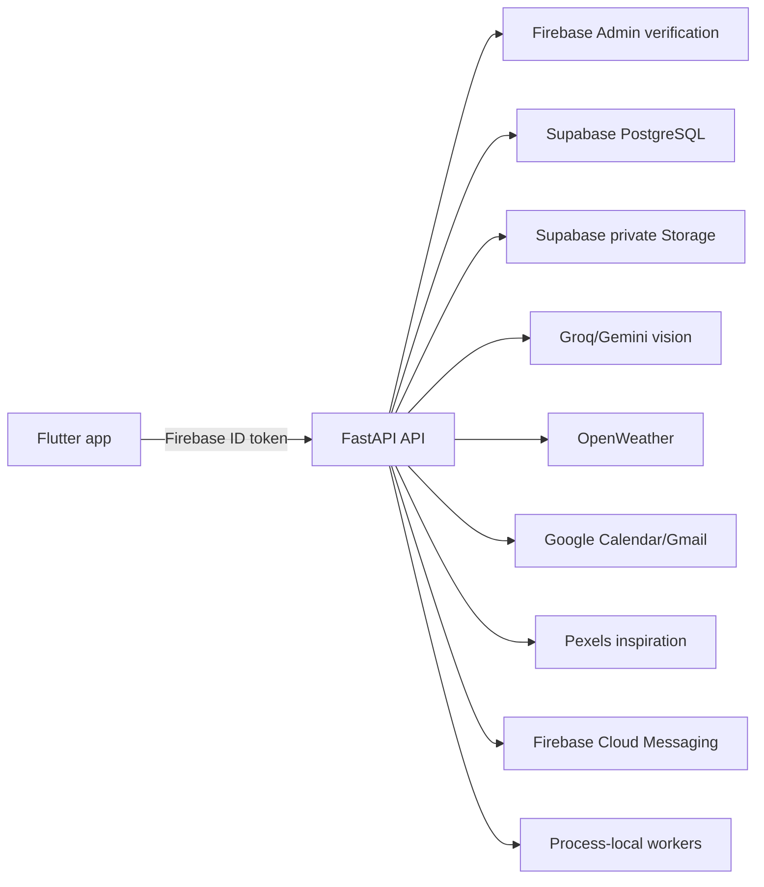
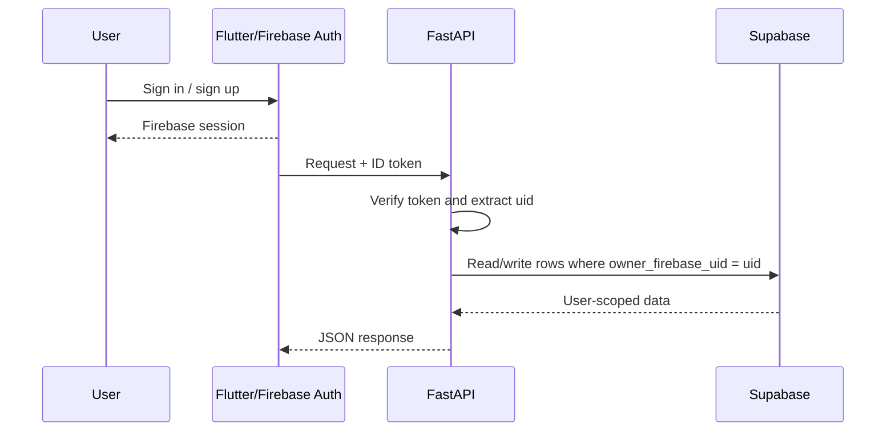
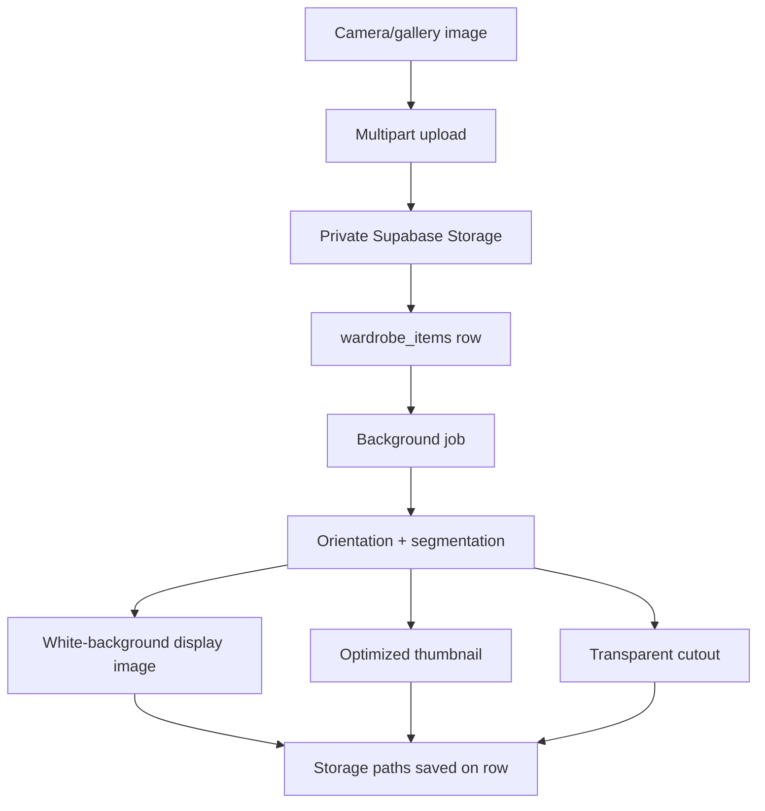
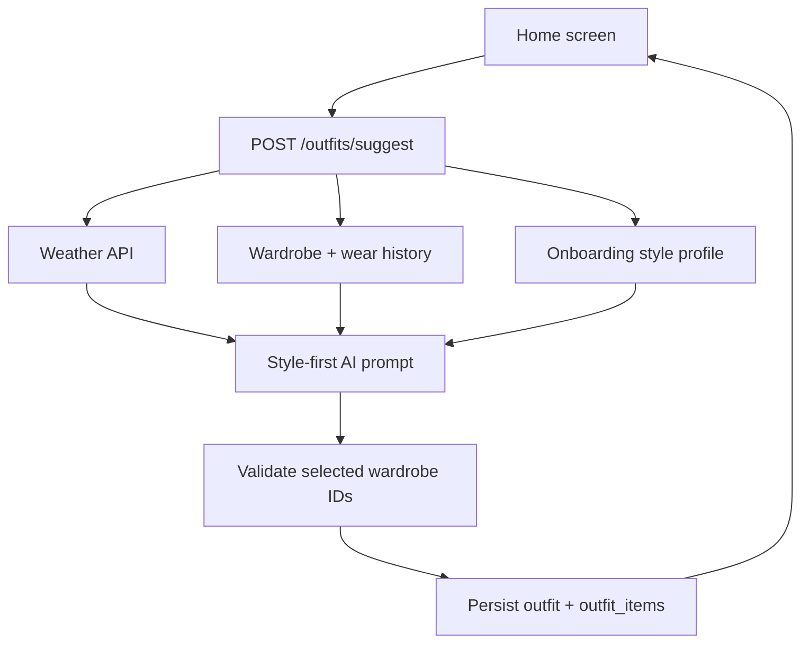
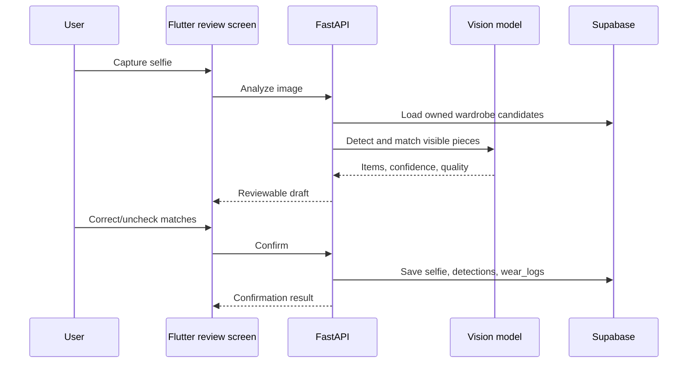

# StyleStack Feature Reference

This document describes the features currently implemented in the StyleStack
backend and Flutter client. It is intentionally based on the code in this
repository and the sibling Flutter project:

- Backend: `StyleStack-be/`
- Flutter client: `stylestack_fe/`

## System overview



The API is mounted under `/api/v1`. Every user data request is scoped to the
Firebase UID extracted from the verified bearer token. Supabase uses the
service-role key only on the backend; mobile clients never receive it.

## 1. Authentication and account lifecycle

### What is implemented

The Flutter app supports:

- Email/password sign-up
- Email/password sign-in
- Google sign-in
- Phone-number OTP sign-in
- Sign-out and Firebase auth-state restoration

`firebase_auth` owns the client session. `AuthProvider` listens to
`authStateChanges`; when a user is signed in, API calls obtain a Firebase ID
token and send it as:

```http
Authorization: Bearer <firebase-id-token>
```

The FastAPI `CurrentUser` dependency verifies that token with Firebase Admin.
The protected identity endpoint returns only the verified UID:

```http
GET /api/v1/users/me
```

```json
{"user_id":"firebase-uid-123"}
```

### Account flow



## 2. Personalized onboarding

The onboarding wizard collects optional personalization signals:

- Display name
- Gender identity
- Date of birth (used only to derive an age group)
- Body type
- Height
- Preferred styles, including Indian ethnic style
- Shopping frequency
- Goals such as daily outfit ideas, reducing decision fatigue, and wear
  tracking

The values are stored on `profiles` and can be read or completed through:

```text
GET /api/v1/users/me/onboarding
PUT /api/v1/users/me/onboarding
```

The stylist receives a reduced style context (for example `preferred_styles`,
`body_type`, `height_cm`, and `age_group`) rather than raw unnecessary values.
If the database migration is missing, the API returns a clear 503 explaining
that the onboarding migration must be applied.

## 3. Wardrobe capture and item creation

### Camera, gallery, and multi-image capture

The Flutter app can capture an image from the camera or select images from the
gallery. The batch flow presents each selected photo as a draft, lets the user
review/edit fields, and uploads selected drafts sequentially. Each upload is a
separate wardrobe item and each item can be processed asynchronously.

The primary endpoint is:

```text
POST /api/v1/wardrobe/items
Content-Type: multipart/form-data
```

Required fields are `name`, `category`, and `image`. Optional fields include
brand, color, season, tags, description, formality, notes, price, currency,
favorite state, and AI preview fields.

Example:

```bash
curl -X POST http://localhost:8000/api/v1/wardrobe/items \
  -H "Authorization: Bearer $FIREBASE_ID_TOKEN" \
  -F "name=White linen shirt" \
  -F "category=shirt" \
  -F "color=white" \
  -F "season=summer,all" \
  -F "tags=linen,minimal,breathable" \
  -F "image=@white-shirt.jpg"
```

Supported image types are JPEG, PNG, and WebP. The API limits the original
upload to 10 MB and stores it under a UID-prefixed private Storage path. The
original filename is never trusted as a storage path.

### Automatic image processing

The backend, rather than the phone, performs the heavy image work:

1. Correct EXIF orientation.
2. Attempt fashion-aware garment segmentation.
3. Fall back to `rembg` background removal when needed.
4. Preserve the complete source canvas; no center crop is performed.
5. Generate an optimized image and a smaller aspect-preserving thumbnail.
6. Generate a transparent cutout for the style canvas when possible.

The database stores `image_path`, `thumbnail_path`, and `cutout_path`. Signed
URLs are generated only when returning an item to its owner.



## 4. AI clothing analysis and tagging

The add-item form can request a preview analysis before saving:

```text
POST /api/v1/wardrobe/analyze-image
POST /api/v1/wardrobe/detect-items
```

`analyze-image` returns one clothing object. `detect-items` returns multiple
wardrobe-relevant detections (up to 12) so one photo can contain a shirt,
pants, shoes, and accessories. The user can unselect detections and edit the
fields before uploading each item.

Supported categories include western and Indian garments:

```text
shirt, pants, dress, jacket, shoes, accessory,
kurta, saree, lehenga, sherwani, salwar, dhoti, dupatta,
blouse, anarkali, ethnic_set, other
```

AI returns category, color, season, formality, description, concise tags, and
stable visual traits. These are stored separately from manual fields as
`ai_category`, `ai_color`, `ai_season`, `ai_formality`, `ai_description`, and
`ai_visual_tags`. Manual corrections therefore survive later AI processing.

### Asynchronous tagging

After the database row is created, a process-local worker queue receives an
`ImageTaggingJob`. The upload response returns immediately with
`ai_tag_status: "pending"`. The worker changes the status to `processing`,
calls Groq Vision (and Gemini where configured as fallback), validates the JSON,
updates the AI columns, and finishes as `completed` or `failed`.

```text
GET /api/v1/wardrobe/items/{item_id}/tag-status
```

Failures are retried up to three times and logged without blocking the upload.
The queue is intentionally process-local for MVP: jobs are lost on process
restart and multiple server workers have independent queues. A durable queue is
required before production scaling.

## 5. Wardrobe browsing and ownership-safe CRUD

Implemented endpoints:

```text
GET    /api/v1/wardrobe/items
GET    /api/v1/wardrobe/items/{id}
PUT    /api/v1/wardrobe/items/{id}
DELETE /api/v1/wardrobe/items/{id}
POST   /api/v1/wardrobe/items/{id}/wear
```

List filters include category, brand, color, tag, favorite state, text search,
pagination, and sorting support in the client. The Flutter wardrobe view adds
search, category/color/season/formality filters, item counts, newest/oldest/
most-worn sorting, pull-to-refresh, empty state, and item detail editing.

Every read/update/delete/wear query combines the item ID with the current
Firebase UID. A different user's item behaves as not found rather than leaking
its existence.

Example wear log:

```json
POST /api/v1/wardrobe/items/ITEM_ID/wear
{
  "worn_at": "2026-07-18T09:00:00Z",
  "notes": "Client meeting"
}
```

Wear logs power recently-worn avoidance in outfit recommendations.

## 6. Daily and event-aware outfit stylist

The daily home view is the main StyleStack experience. It can show:

- A weather context strip
- A high-priority outfit for a calendar event happening today
- The normal outfit for the rest of the day
- A compact all-items outfit board
- “Why this works” styling explanation
- A “See the vibe” inspiration section
- Outfit selfie logging and canvas-style actions

The API endpoint is:

```text
POST /api/v1/outfits/suggest
{
  "city": "Mumbai",
  "occasion": "daily"
}
```

The backend:

1. Fetches current weather for the city.
2. Loads the signed-in user's wardrobe.
3. Excludes the most recently worn items when alternatives exist.
4. Loads onboarding style context.
5. Sends the wardrobe, weather, occasion, and style context to the style-first
   master prompt in `app/prompts/outfit_stylist.py`.
6. Validates returned item IDs against the candidate wardrobe.
7. Persists an `outfits` row and ordered `outfit_items` links.
8. Adds signed image URLs and optional Pexels inspiration results.



The stored outfit can be retrieved and logged as worn:

```text
GET  /api/v1/outfits/{outfit_id}
POST /api/v1/outfits/{outfit_id}/wear
```

The outfit prompt favors styling and personal wardrobe compatibility; weather
is a supporting constraint, not the product's primary purpose.

## 7. Calendar integration and event outfits

Users can manually create and delete events:

```text
GET    /api/v1/calendar/events?start=...&end=...
POST   /api/v1/calendar/events
DELETE /api/v1/calendar/events/{event_id}
```

Google Calendar is opt-in. The calendar screen provides:

- Connect and grant read-only access
- Initial event import
- Manual “sync now”
- Daily automatic sync while connected
- Disconnect and remove imported Google events

Backend OAuth endpoints are:

```text
GET    /api/v1/calendar/google/status
POST   /api/v1/calendar/google/connect
POST   /api/v1/calendar/google/sync
DELETE /api/v1/calendar/google/connection
```

Google events are upserted as `source = "google"`; manually created events use
`source = "manual"`. The home screen prioritizes a meeting/event outfit for
today and still shows the general daily outfit.

## 8. Morning and event notifications

Users can configure city, timezone, opt-in, and notification time:

```text
GET /api/v1/users/me/preferences
PUT /api/v1/users/me/preferences
```

The Flutter client registers Firebase Cloud Messaging device tokens through:

```text
POST   /api/v1/users/me/devices
DELETE /api/v1/users/me/devices
POST   /api/v1/users/me/test-notification
```

The backend scheduler polls enabled profiles. At each user's configured local
time it:

1. Generates the daily outfit.
2. Saves an `app_notifications` row.
3. Sends an FCM push to registered devices.
4. Processes tomorrow-event reminders.

Event reminders generate an outfit for events tomorrow and attach its outfit ID
to the notification when successful. The test lab calls the same production
functions immediately:

```text
POST /api/v1/users/me/simulations/daily-outfit
POST /api/v1/users/me/simulations/tomorrow-events
```

The notification scheduler is process-local. If the API process is down, its
polling loop cannot run; use one durable scheduled worker for production.

## 9. In-app notification inbox

Notifications are persisted in `app_notifications` so they remain visible even
when a push was missed. The Flutter notification inbox reads:

```text
GET /api/v1/calendar/notifications?limit=50
POST /api/v1/calendar/notifications/{notification_id}/read
```

Unread state is represented by `read_at`. Tapping an outfit notification opens
the relevant planned outfit when an outfit ID is present.

## 10. Outfit Selfie: log what was actually worn

The user takes a full-body outfit selfie, then reviews the detections before
confirming. The analysis:

1. Checks image quality and returns retake guidance when unusable.
2. Detects visible garments/accessories.
3. Matches each detection against the user's wardrobe candidates.
4. Returns confidence, description, visual tags, and matched item ID.
5. Lets the user uncheck detections or choose another wardrobe match.
6. On confirmation, inserts wear logs for selected matched items.
7. Saves the selfie and confirmed detections for the profile timeline.

```text
POST   /api/v1/wardrobe/outfit-selfies/analyze
POST   /api/v1/wardrobe/outfit-selfies/{selfie_id}/confirm
DELETE /api/v1/wardrobe/outfit-selfies/{selfie_id}
GET    /api/v1/wardrobe/outfit-selfies/history
```



Unmatched pieces are shown to the user with an option to add them later. The
feature deliberately does not identify the person or infer sensitive traits.

## 11. Gmail Closet Sync

Profile settings contain an opt-in Gmail import flow. The Flutter client obtains
a short-lived, user-consented Gmail token and sends it to:

```text
POST /api/v1/imports/gmail
```

The backend currently focuses on confirmed Amazon delivery messages. It filters
for Amazon transactional senders and `Delivered:` subjects, ignores shipped,
arriving, cancelled, returned, refunded, and promotional messages, and follows
related messages in the same order thread to recover the product title.

For eligible emails it:

1. Parses HTML and inline image references.
2. Rejects logos, icons, tracking pixels, catalog banners, and non-product
   assets.
3. Upgrades Amazon thumbnail URLs to catalog image URLs where possible.
4. Uses the product title from the email/thread as the item name.
5. Downloads the product image and stores it privately.
6. Applies AI clothing analysis and stores AI fields/tags.
7. Uses `import_source` and `source_external_id` to avoid duplicate imports.

Gmail message content and access tokens are not persisted as permanent user
data. The Flutter provider shows a background sync state, progress text, and
refreshes the wardrobe when the import completes.

## 12. Canvas Style Builder

The canvas feature lets users create a reusable visual outfit arrangement from
their own wardrobe:

- Browse wardrobe cutouts in a horizontal item tray
- Add multiple pieces to a light grid canvas
- Select an item and move, scale, or rotate it
- Delete the focused item
- Clear and undo canvas changes
- Capture a preview image
- Save, reopen, edit, delete, and share saved styles

Persistence endpoints:

```text
POST   /api/v1/canvas/styles
GET    /api/v1/canvas/styles
GET    /api/v1/canvas/styles/{style_id}
PUT    /api/v1/canvas/styles/{style_id}
DELETE /api/v1/canvas/styles/{style_id}
```

The multipart save request contains a name, an `items` JSON array, and a
preview image. Each item stores its wardrobe ID and transform:

```json
[
  {"item_id":"shirt-uuid","x":120,"y":80,"scale":1.1,"rotation":0.0},
  {"item_id":"pants-uuid","x":140,"y":300,"scale":0.9,"rotation":0.0}
]
```

The API verifies that every referenced item belongs to the caller before saving
the JSONB arrangement and preview to private Storage.

## 13. Location and profile utilities

The Flutter profile flow can request device location, reverse-geocode it to a
city, and save that city for weather and outfit generation. It also exposes:

- Notification time and enable/disable controls
- Test push notification
- Outfit history timeline
- Saved styles
- Google Calendar connection controls
- Gmail Closet Sync
- Wardrobe clear/delete action
- Test Lab for backend reachability and production-flow simulations

## 14. Backend safety and operational behavior

- Firebase tokens, service keys, and image contents are not written to normal
  request logs.
- Request logs include method, path, status, and duration.
- Supabase tables are RLS-enabled and backend-only policies are used for
  sensitive persisted data.
- Private image objects are exposed through short-lived signed URLs.
- Uploads and database inserts use compensating cleanup to reduce orphaned
  Storage objects.
- The API exposes `GET /health` for local checks and Render health checks.
- Docker and Render deployment files are included in the backend repository.

## 15. Current limitations to know before production

These features work in the MVP architecture but have explicit deployment
constraints:

1. AI tagging and notification scheduling use in-process threads. Use a durable
   queue and a single scheduled worker before horizontal scaling.
2. Gmail import is currently specialized around Amazon delivered-order emails;
   other merchants need their own parser and sender/status rules.
3. AI results depend on configured Groq/Gemini keys and provider quotas. Manual
   editing remains available when AI is unavailable.
4. Pexels inspiration is optional. The default relevance gate is metadata-based;
   CLIP scoring is optional and should only be enabled when its server resource
   cost is acceptable.
5. Push delivery additionally requires Firebase Cloud Messaging configuration
   and, for iOS, APNs credentials on a physical device.
6. A local physical-device build must use the computer's LAN API URL; Android
   emulator builds can use `10.0.2.2` for a backend on the host machine.

## 16. Quick end-to-end example

```text
1. User signs in with Firebase.
2. User completes onboarding: minimal + office style, Mumbai, daily ideas.
3. User selects a shirt photo from the gallery.
4. Backend stores the original, white-background image, thumbnail, and cutout.
5. Background AI tags it as a white shirt with visual traits.
6. User adds pants and shoes in the same way.
7. At home, StyleStack reads today's weather and recent wear logs.
8. The style-first prompt chooses a complete look from the user's wardrobe.
9. A “Why this works” explanation and filtered Pexels vibe references appear.
10. A connected calendar interview can override the daily card with an
    interview-appropriate event look.
11. The user can log the look by selfie, save it on the canvas, or mark it worn.
```

