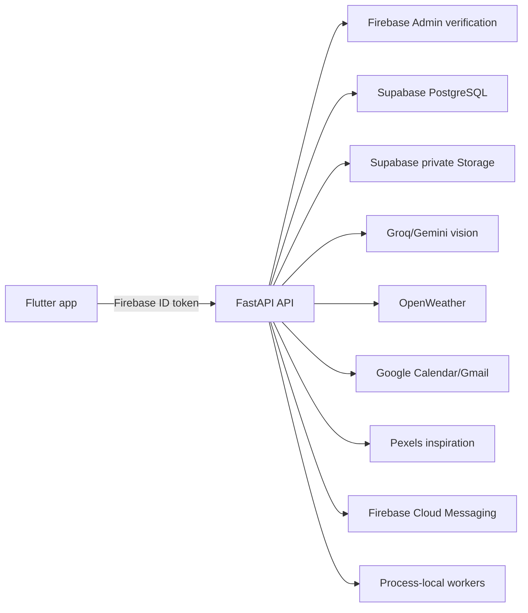
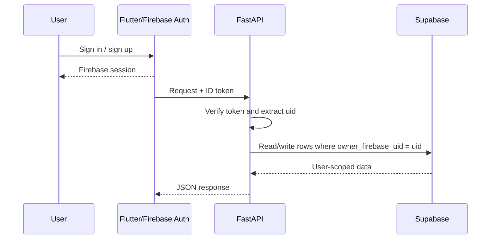
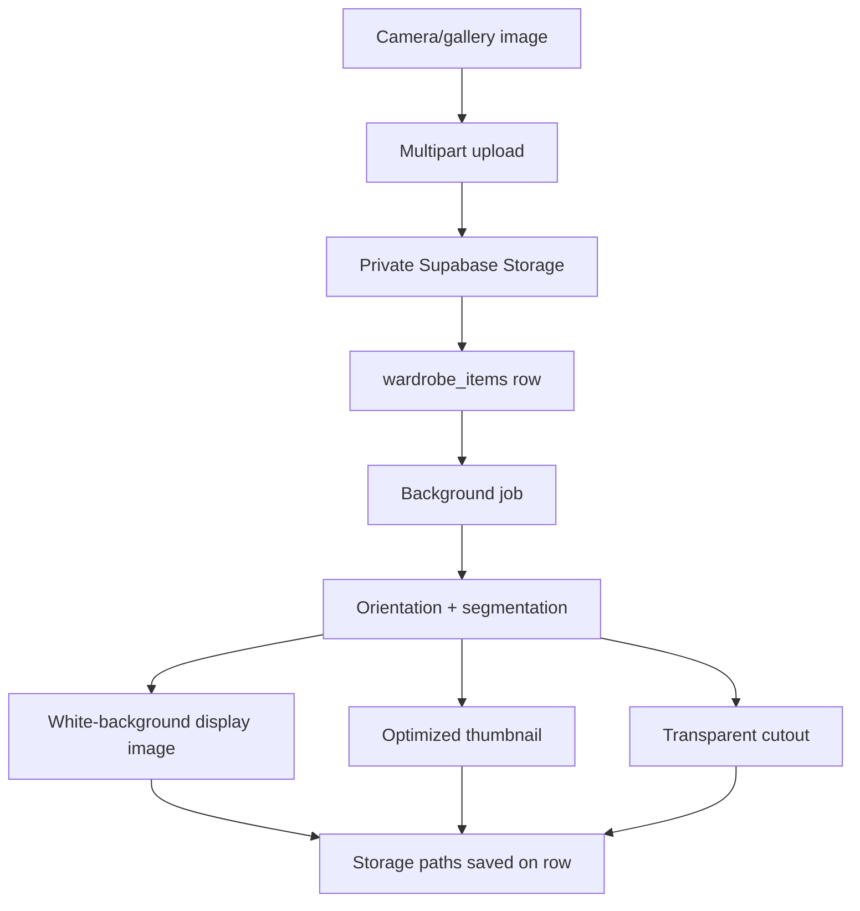
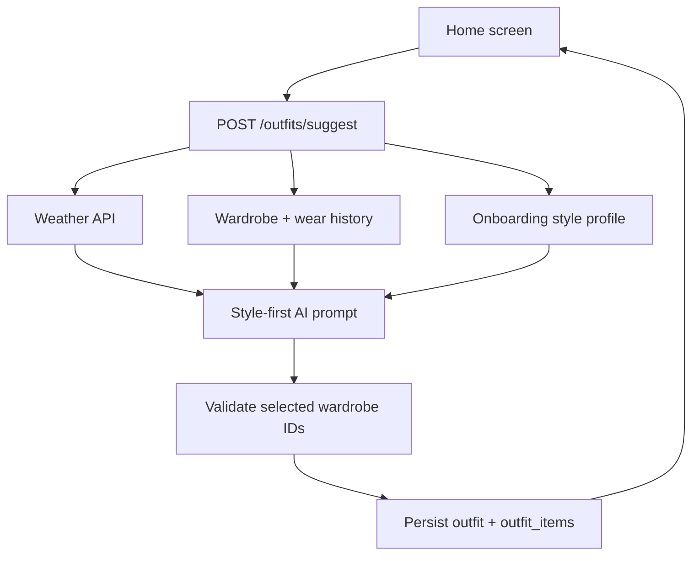
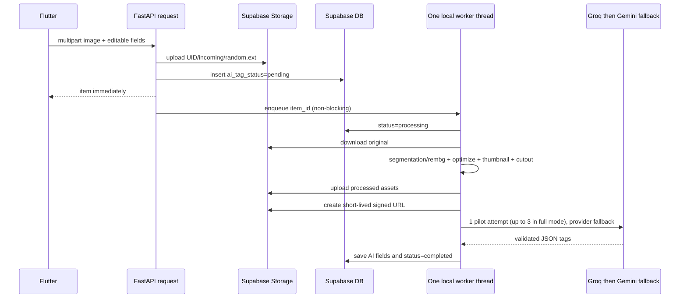

# StyleStack Feature Reference

This document describes the features currently implemented in the StyleStack
backend and Flutter client. It is intentionally based on the code in this
repository and the sibling Flutter project:

- Backend: `StyleStack-be/`
- Flutter client: `stylestack_fe/`

## System overview



The API is mounted under `/api/v1`. Every user data request is scoped to the
Firebase UID extracted from the verified bearer token. Supabase uses the
service-role key only on the backend; mobile clients never receive it.

## 1. Authentication and account lifecycle

### What is implemented

The Flutter app supports:

- Email/password sign-up
- Email/password sign-in
- Google sign-in
- Phone-number OTP sign-in
- Sign-out and Firebase auth-state restoration

`firebase_auth` owns the client session. `AuthProvider` listens to
`authStateChanges`; when a user is signed in, API calls obtain a Firebase ID
token and send it as:

```http
Authorization: Bearer <firebase-id-token>
```

The FastAPI `CurrentUser` dependency verifies that token with Firebase Admin.
The protected identity endpoint returns only the verified UID:

```http
GET /api/v1/users/me
```

```json
{"user_id":"firebase-uid-123"}
```

### Account flow



## 2. Personalized onboarding

The onboarding wizard collects optional personalization signals:

- Display name
- Gender identity
- Date of birth (used only to derive an age group)
- Body type
- Height
- Preferred styles, including Indian ethnic style
- Shopping frequency
- Goals such as daily outfit ideas, reducing decision fatigue, and wear
  tracking

The values are stored on `profiles` and can be read or completed through:

```text
GET /api/v1/users/me/onboarding
PUT /api/v1/users/me/onboarding
```

The stylist receives a reduced style context (for example `preferred_styles`,
`body_type`, `height_cm`, and `age_group`) rather than raw unnecessary values.
If the database migration is missing, the API returns a clear 503 explaining
that the onboarding migration must be applied.

## 3. Wardrobe capture and item creation

### Camera, gallery, and multi-image capture

The Flutter app can capture an image from the camera or select images from the
gallery. The batch flow presents each selected photo as a draft, lets the user
review/edit fields, and uploads selected drafts sequentially. Each upload is a
separate wardrobe item and each item can be processed asynchronously.

The primary endpoint is:

```text
POST /api/v1/wardrobe/items
Content-Type: multipart/form-data
```

Required fields are `name`, `category`, and `image`. Optional fields include
brand, color, season, tags, description, formality, notes, price, currency,
favorite state, and AI preview fields.

Example:

```bash
curl -X POST http://localhost:8000/api/v1/wardrobe/items \
  -H "Authorization: Bearer $FIREBASE_ID_TOKEN" \
  -F "name=White linen shirt" \
  -F "category=shirt" \
  -F "color=white" \
  -F "season=summer,all" \
  -F "tags=linen,minimal,breathable" \
  -F "image=@white-shirt.jpg"
```

Supported image types are JPEG, PNG, and WebP. The API limits the original
upload to 10 MB and stores it under a UID-prefixed private Storage path. The
original filename is never trusted as a storage path.

### Automatic image processing

The backend, rather than the phone, performs the heavy image work:

1. Correct EXIF orientation.
2. Attempt fashion-aware garment segmentation.
3. Fall back to `rembg` background removal when needed.
4. Preserve the complete source canvas; no center crop is performed.
5. Generate an optimized image and a smaller aspect-preserving thumbnail.
6. Generate a transparent cutout for the style canvas when possible.

The database stores `image_path`, `thumbnail_path`, and `cutout_path`. Signed
URLs are generated only when returning an item to its owner.



## 4. AI clothing analysis and tagging

The add-item form can request a preview analysis before saving:

```text
POST /api/v1/wardrobe/analyze-image
POST /api/v1/wardrobe/detect-items
```

`analyze-image` returns one clothing object. `detect-items` returns multiple
wardrobe-relevant detections (up to 12) so one photo can contain a shirt,
pants, shoes, and accessories. The user can unselect detections and edit the
fields before uploading each item.

Supported categories include western and Indian garments:

```text
shirt, pants, dress, jacket, shoes, accessory,
kurta, saree, lehenga, sherwani, salwar, dhoti, dupatta,
blouse, anarkali, ethnic_set, other
```

AI returns category, color, season, formality, description, concise tags, and
stable visual traits. These are stored separately from manual fields as
`ai_category`, `ai_color`, `ai_season`, `ai_formality`, `ai_description`, and
`ai_visual_tags`. Manual corrections therefore survive later AI processing.

### Asynchronous tagging

After the database row is created, a process-local worker queue receives an
`ImageTaggingJob`. The upload response returns immediately with
`ai_tag_status: "pending"`. The worker changes the status to `processing`,
calls Groq Vision (and Gemini where configured as fallback), validates the JSON,
updates the AI columns, and finishes as `completed` or `failed`.

```text
GET /api/v1/wardrobe/items/{item_id}/tag-status
```

In normal mode, failures are retried up to three times and logged without
blocking the upload. In the current free pilot mode, tagging uses one attempt
per item to avoid multiplying provider usage; a failed item remains editable
and can be retried later.
The queue is intentionally process-local for MVP: jobs are lost on process
restart and multiple server workers have independent queues. A durable queue is
required before production scaling.

## 5. Wardrobe browsing and ownership-safe CRUD

Implemented endpoints:

```text
GET    /api/v1/wardrobe/items
GET    /api/v1/wardrobe/items/{id}
PUT    /api/v1/wardrobe/items/{id}
DELETE /api/v1/wardrobe/items/{id}
POST   /api/v1/wardrobe/items/{id}/wear
```

List filters include category, brand, color, tag, favorite state, text search,
pagination, and sorting support in the client. The Flutter wardrobe view adds
search, category/color/season/formality filters, item counts, newest/oldest/
most-worn sorting, pull-to-refresh, empty state, and item detail editing.

Every read/update/delete/wear query combines the item ID with the current
Firebase UID. A different user's item behaves as not found rather than leaking
its existence.

Example wear log:

```json
POST /api/v1/wardrobe/items/ITEM_ID/wear
{
  "worn_at": "2026-07-18T09:00:00Z",
  "notes": "Client meeting"
}
```

Wear logs power recently-worn avoidance in outfit recommendations.

## 6. Daily and event-aware outfit stylist

The daily home view is the main StyleStack experience. It can show:

- A weather context strip
- A high-priority outfit for a calendar event happening today
- The normal outfit for the rest of the day
- A compact all-items outfit board
- “Why this works” styling explanation
- A “See the vibe” inspiration section
- Outfit selfie logging and canvas-style actions

The API endpoint is:

```text
POST /api/v1/outfits/suggest
{
  "city": "Mumbai",
  "occasion": "daily"
}
```

The backend:

1. Fetches current weather for the city.
2. Loads the signed-in user's wardrobe.
3. Excludes the most recently worn items when alternatives exist.
4. Loads onboarding style context.
5. Sends the wardrobe, weather, occasion, and style context to the style-first
   master prompt in `app/prompts/outfit_stylist.py`.
6. Validates returned item IDs against the candidate wardrobe.
7. Persists an `outfits` row and ordered `outfit_items` links.
8. Adds signed image URLs and optional Pexels inspiration results.



The stored outfit can be retrieved and logged as worn:

```text
GET  /api/v1/outfits/{outfit_id}
POST /api/v1/outfits/{outfit_id}/wear
```

The outfit prompt favors styling and personal wardrobe compatibility; weather
is a supporting constraint, not the product's primary purpose.

## 7. Calendar integration and event outfits

Users can manually create and delete events:

```text
GET    /api/v1/calendar/events?start=...&end=...
POST   /api/v1/calendar/events
DELETE /api/v1/calendar/events/{event_id}
```

Google Calendar is opt-in. The calendar screen provides:

- Connect and grant read-only access
- Initial event import
- Manual “sync now”
- Daily automatic sync while connected
- Disconnect and remove imported Google events

Backend OAuth endpoints are:

```text
GET    /api/v1/calendar/google/status
POST   /api/v1/calendar/google/connect
POST   /api/v1/calendar/google/sync
DELETE /api/v1/calendar/google/connection
```

Google events are upserted as `source = "google"`; manually created events use
`source = "manual"`. The home screen prioritizes a meeting/event outfit for
today and still shows the general daily outfit.

## 8. Morning and event notifications

Users can configure city, timezone, opt-in, and notification time:

```text
GET /api/v1/users/me/preferences
PUT /api/v1/users/me/preferences
```

The Flutter client registers Firebase Cloud Messaging device tokens through:

```text
POST   /api/v1/users/me/devices
DELETE /api/v1/users/me/devices
POST   /api/v1/users/me/test-notification
```

The backend scheduler polls enabled profiles. At each user's configured local
time it:

1. Generates the daily outfit.
2. Saves an `app_notifications` row.
3. Sends an FCM push to registered devices.
4. Processes tomorrow-event reminders.

Event reminders generate an outfit for events tomorrow and attach its outfit ID
to the notification when successful. The test lab calls the same production
functions immediately:

```text
POST /api/v1/users/me/simulations/daily-outfit
POST /api/v1/users/me/simulations/tomorrow-events
```

The notification scheduler is process-local. If the API process is down, its
polling loop cannot run; use one durable scheduled worker for production.

## 9. In-app notification inbox

Notifications are persisted in `app_notifications` so they remain visible even
when a push was missed. The Flutter notification inbox reads:

```text
GET /api/v1/calendar/notifications?limit=50
POST /api/v1/calendar/notifications/{notification_id}/read
```

Unread state is represented by `read_at`. Tapping an outfit notification opens
the relevant planned outfit when an outfit ID is present.

## 10. Wear history (selfie analysis paused)

The Outfit Selfie rollout is paused to remove its vision-AI and image-processing
cost from the MVP. The selfie router is not mounted and the Flutter app exposes
no capture entry point. The dormant implementation and historical records are
preserved so the feature can be reconsidered later without a destructive
migration.

The active timeline uses `wear_logs` instead. Selecting **Log this outfit** on a
suggested look records all its wardrobe items with the same timestamp. The
timeline groups those rows and displays the logged pieces:

```text
POST /api/v1/outfits/{outfit_id}/wear
GET  /api/v1/wardrobe/wear-history
```

## 11. Gmail Closet Sync

Profile settings contain an opt-in Gmail import flow. The Flutter client obtains
a short-lived, user-consented Gmail token and sends it to:

```text
POST /api/v1/imports/gmail
```

The backend currently focuses on confirmed Amazon delivery messages. It filters
for Amazon transactional senders and `Delivered:` subjects, ignores shipped,
arriving, cancelled, returned, refunded, and promotional messages, and follows
related messages in the same order thread to recover the product title.

For eligible emails it:

1. Parses HTML and inline image references.
2. Rejects logos, icons, tracking pixels, catalog banners, and non-product
   assets.
3. Upgrades Amazon thumbnail URLs to catalog image URLs where possible.
4. Uses the product title from the email/thread as the item name.
5. Downloads the product image and stores it privately.
6. Applies AI clothing analysis and stores AI fields/tags.
7. Uses `import_source` and `source_external_id` to avoid duplicate imports.

Gmail message content and access tokens are not persisted as permanent user
data. The Flutter provider shows a background sync state, progress text, and
refreshes the wardrobe when the import completes.

## 12. Canvas Style Builder

The canvas feature lets users create a reusable visual outfit arrangement from
their own wardrobe:

- Browse wardrobe cutouts in a horizontal item tray
- Add multiple pieces to a light grid canvas
- Select an item and move, scale, or rotate it
- Delete the focused item
- Clear and undo canvas changes
- Capture a preview image
- Save, reopen, edit, delete, and share saved styles

Persistence endpoints:

```text
POST   /api/v1/canvas/styles
GET    /api/v1/canvas/styles
GET    /api/v1/canvas/styles/{style_id}
PUT    /api/v1/canvas/styles/{style_id}
DELETE /api/v1/canvas/styles/{style_id}
```

The multipart save request contains a name, an `items` JSON array, and a
preview image. Each item stores its wardrobe ID and transform:

```json
[
  {"item_id":"shirt-uuid","x":120,"y":80,"scale":1.1,"rotation":0.0},
  {"item_id":"pants-uuid","x":140,"y":300,"scale":0.9,"rotation":0.0}
]
```

The API verifies that every referenced item belongs to the caller before saving
the JSONB arrangement and preview to private Storage.

## 13. Location and profile utilities

The Flutter profile flow can request device location, reverse-geocode it to a
city, and save that city for weather and outfit generation. It also exposes:

- Notification time and enable/disable controls
- Test push notification
- Outfit history timeline
- Saved styles
- Google Calendar connection controls
- Gmail Closet Sync
- Wardrobe clear/delete action
- Test Lab for backend reachability and production-flow simulations

## 14. Backend safety and operational behavior

- Firebase tokens, service keys, and image contents are not written to normal
  request logs.
- Request logs include method, path, status, and duration.
- Supabase tables are RLS-enabled and backend-only policies are used for
  sensitive persisted data.
- Private image objects are exposed through short-lived signed URLs.
- Uploads and database inserts use compensating cleanup to reduce orphaned
  Storage objects.
- The API exposes `GET /health` for local checks and Render health checks.
- Docker and Render deployment files are included in the backend repository.

## 15. Current limitations to know before production

These features work in the MVP architecture but have explicit deployment
constraints:

1. AI tagging and notification scheduling use in-process threads. Use a durable
   queue and a single scheduled worker before horizontal scaling.
2. Gmail import is currently specialized around Amazon delivered-order emails;
   other merchants need their own parser and sender/status rules.
3. AI results depend on configured Groq/Gemini keys and provider quotas. Manual
   editing remains available when AI is unavailable.
4. Pexels inspiration is optional. The default relevance gate is metadata-based;
   CLIP scoring is optional and should only be enabled when its server resource
   cost is acceptable.
5. Push delivery additionally requires Firebase Cloud Messaging configuration
   and, for iOS, APNs credentials on a physical device.
6. A local physical-device build must use the computer's LAN API URL; Android
   emulator builds can use `10.0.2.2` for a backend on the host machine.

## 16. Scalability and cost scorecard

“Works” and “scales” are different properties. The current MVP is a single
FastAPI process with Supabase doing persistence and several external APIs doing
AI, weather, calendar, Gmail, inspiration, and push delivery.

| Feature | Current status | Main bottleneck | Production direction |
| --- | --- | --- | --- |
| Firebase auth | Good | Firebase quotas and token verification latency | Keep; add rate limits and observability |
| Wardrobe CRUD | Near scale-ready | Unbounded queries and signed-URL work | Enforce pagination, indexes, caching, and rate limits |
| Image processing | Not scale-ready | CPU/RAM-heavy local models in API workers | Dedicated image-worker queue and autoscaling |
| AI tagging | Not scale-ready | One in-process worker; provider quotas | Durable jobs, backoff, idempotency, provider budgets |
| Outfit generation | Partially ready | Synchronous AI + weather + Pexels calls | Cache by user/date/context and generate asynchronously |
| Outfit selfies | Disabled for MVP | Vision and image-processing cost | Reassess before a later opt-in rollout |
| Gmail sync | Not scale-ready | Message pagination, image downloads, AI calls | Background jobs, checkpoints, per-order dedupe |
| Google Calendar | Partially ready | Token refresh and repeated window sync | Incremental sync tokens and scheduled worker |
| Notifications | Not scale-ready | Process-local minute poller | One durable scheduler and FCM fanout worker |
| Pexels inspiration | Partially ready | One external request per outfit | Cache normalized queries and enforce budgets |
| Canvas styles | Near scale-ready | Preview size and signed URLs | Resize previews and add CDN/URL caching |

The database CRUD and ownership model are the strongest scaling foundations.
AI, image processing, Gmail, notifications, and inspiration are MVP features,
not production-scale workflows yet.

## 17. Exact AI and model inventory

### Vision tagging and outfit selfies

The primary provider is Groq's OpenAI-compatible chat endpoint using
`GROQ_VISION_MODEL` (currently `qwen/qwen3.6-27b`). The request contains a
compressed image and a JSON-only prompt. When Groq fails and
`GEMINI_API_KEY` is configured, Gemini is attempted using
`GEMINI_VISION_MODEL` (currently `gemini-flash-latest`). Gemini is a remote API,
not a model running on the server.

The prompts live in `app/services/ai_tagging.py`:

- `TAGGING_PROMPT`: one garment, category/color/season/formality, description,
  up to five useful tags, and stable visual traits.
- `MULTI_ITEM_PROMPT`: up to twelve visible wardrobe items in one photo,
  including Indian garments and accessories.
- Outfit-selfie prompt: quality assessment plus conservative matching to the
  user's wardrobe candidates and confidence values.

For a normal upload without complete AI preview fields, the background worker
can perform up to three tagging attempts. Each attempt can call Groq and then
Gemini if Groq fails, so provider calls can be much higher than one per image
during an outage or rate limit. If complete AI preview fields are supplied by
the form, the provider tagging call is skipped.

### Image segmentation and background removal

These are local CPU models, not paid vision API calls:

1. Fashion-aware segmentation uses a quantized ONNX `segformer_b2_clothes`
   model downloaded once per server machine from Hugging Face and cached under
   `~/.stylestack/models/segformer_b2_clothes_quantized.onnx`.
2. Semantic labels select the requested garment category and remove person
   labels. Indian categories map to the closest segmentation classes while the
   vision tagger retains the precise Indian category.
3. If the semantic mask is unreliable, `rembg` uses the configured
   `BACKGROUND_REMOVAL_MODEL` (currently `birefnet-general-lite`) with CPU
   alpha matting.

Both model sessions are lazy and cached per process. Four Gunicorn workers can
therefore initialize four copies and compete for CPU/RAM. This is a major
reason this work belongs in a dedicated worker service before horizontal
scaling.

### Inspiration relevance

Pexels is not an AI classifier. One request returns up to
`PEXELS_RESULTS_PER_REQUEST` photos (currently 10). By default, cheap metadata
rules check human/fashion language, category coverage, color coverage, and
reject terms such as `logo`, `catalog`, `mockup`, and `product`. Every passing
photo may be returned; there is no forced two-image limit in the backend.

Optional local CLIP scoring is controlled by `INSPIRATION_CLIP_ENABLED` and is
false by default. If enabled, the server lazily downloads
`openai/clip-vit-base-patch32` (roughly 600 MB plus runtime memory) and computes
image/text cosine similarity locally. The threshold is a raw cosine value, not
a calibrated accuracy percentage. CLIP is therefore an optional quality gate,
not a guaranteed fashion judge, and is usually unsuitable for a small Render
instance.

## 18. Complete wardrobe-upload cost path



The upload response is fast because it stops after Storage and the initial DB
insert. The expensive work still consumes queue capacity, CPU time, Storage
bandwidth, and usually one or more vision-provider requests.

## 19. Existing cost and latency controls

The MVP already has useful safeguards:

- Vision images are resized to at most 1280px for selfie analysis.
- AI previews are capped at 4 MB; stored uploads are capped at 10 MB.
- Pexels has an 8-second timeout and one request per outfit.
- CLIP is disabled by default to avoid its large model download.
- Vision requests have a 30-second timeout.
- The background queue is bounded at 1,000 and rejects immediately when full.
- In free pilot mode, AI tagging uses one attempt; full mode allows three
  attempts with exponential backoff.
- Incoming image objects are removed after processed assets are ready.
- Signed image URLs are short-lived rather than permanently public.
- Gmail uses merchant/order identifiers for duplicate prevention and does not
  persist raw email HTML or temporary image bytes.
- Notification records use dedupe keys and per-profile date tracking.

These controls do not replace authentication-aware rate limiting, quotas, or
provider usage accounting. Those are required before public launch.

### Current free-pilot behavior

`FREE_PILOT_MODE=true` is the default while validating the product. It also:

- caps preview/detection AI calls at three per user and operation per day;
- caps Gmail scans at ten messages per request;
- caches identical Pexels queries for 24 hours in the API process;
- keeps one image worker and avoids CLIP model downloads.

These limits are intentionally process-local. They protect a single free
instance from bursts but reset after a restart and do not coordinate multiple
replicas. They are suitable for a pilot, not a paid production deployment.

## 20. Recommended scale-up plan

### Before adding multiple API replicas

1. Replace `BackgroundJobQueue` with Redis + RQ/Celery/Arq or a managed queue.
2. Run image processing and AI tagging in a worker deployment with explicit
   CPU/RAM limits.
3. Add a job table with `queued`, `processing`, `completed`, and `failed`
   states, attempts, timestamps, and last error.
4. Add idempotency keys to upload/import requests.
5. Run only one notification scheduler, or move it to durable cron/worker;
   the current poller must not run independently in every web replica.
6. Add per-user daily limits for uploads, AI analyses, Gmail sync, and Pexels.

### Lower cost without reducing quality

1. Validate type, dimensions, blur, and duplicate image hash locally before a
   vision call.
2. Reuse complete user-confirmed AI preview fields instead of re-tagging.
3. Cache tags by perceptual image hash for repeated uploads.
4. Cache weather and outfit suggestions by user/date/occasion/wardrobe version.
5. Cache Pexels responses by normalized query and return the best accepted
   references rather than repeatedly searching the same look.
6. Keep thumbnails/cutouts immutable and serve them through a CDN or signed-URL
   cache.
7. Prefer one multi-item vision request over one provider request per garment.

### Measure quality and spend

Record these safe, non-secret fields per request/job:

```text
request_id, uid_hash, feature, provider, model, attempt,
queue_wait_ms, processing_ms, input_bytes, output_bytes,
status, provider_status_code, retry_count, estimated_cost
```

Dashboards should track AI fallback rate, upload-to-tag p50/p95 latency, queue
depth, CPU/RAM time, Pexels acceptance/empty-result rate, Gmail imported versus
skipped messages, notification delivery, and cost per active user.

## 21. Highest-value optimizations before spending money

These changes improve speed or reduce provider calls without adding another
service:

1. **Reuse today's outfit.** Before calling Groq, look for an existing outfit
   for the same user, local date, occasion, and unchanged wardrobe version.
   This prevents app restarts or refreshes from generating duplicate looks.
2. **Paginate wardrobe reads.** The Wardrobe tab should request 30–50 items at a
   time and load more on scroll. Today’s recommendation can continue reading
   compact metadata server-side without downloading every image to the phone.
3. **Cache weather briefly.** Cache a city's weather response for 10–15 minutes
   so event and daily generation do not make duplicate weather requests.
4. **Add a provider circuit breaker.** After repeated Groq/Gemini failures,
   temporarily skip new AI calls and show a manual retry state instead of
   waiting through repeated timeouts.
5. **Track lightweight timing metrics.** Log request ID, feature, provider,
   queue wait, processing duration, bytes, retry count, and status—never image
   contents or tokens. This identifies the real bottleneck before scaling.
6. **Keep heavy work on one worker.** Do not add Gunicorn workers on a free
   instance while local segmentation is enabled; each process can load its own
   model copy and increase memory pressure.

## 22. Small paid options worth considering

The first paid improvement should be reliable scheduling, not Redis. Render's
current pricing lists Cron Jobs from $1/month, while its managed Redis-compatible
Key Value service has a free 25 MB tier and a $10/month Starter tier. The free
tier is adequate for optional caching but has no persistence, so it is not a
durable job queue. See [Render pricing](https://render.com/pricing) and
[Render Key Value documentation](https://render.com/docs/key-value) for the
current limits.

Recommended order:

1. **$0:** implement outfit reuse, pagination, weather caching, and a provider
   circuit breaker.
2. **About $1/month:** add one Render Cron job that calls a protected scheduler
   endpoint for morning/event notifications. This removes dependence on the
   API process being awake at the exact minute.
3. **About $10/month when needed:** add Render Key Value for a shared queue,
   distributed rate limits, and cross-instance cache. Do this only when the
   API has multiple replicas or the in-process queue is demonstrably losing
   work.
4. **After that:** move image processing and AI tagging to a dedicated worker;
   this improves reliability but is a larger compute decision, not a cache
   purchase.

At 1,000 users, Redis is not automatically necessary. A single API instance,
Supabase persistence, bounded provider calls, and the free-pilot controls are
the lowest-risk starting point.

## 23. Feature readiness definitions

- **MVP-ready:** works in one process, failures are visible, and manual
  recovery exists.
- **Scale-ready:** safe across restarts and replicas, idempotent, rate-limited,
  observable, and has bounded cost.
- **Quality-ready:** measured on representative images with known false-positive
  and false-negative rates, not just a successful demo.

Using those definitions, Firebase ownership, Supabase persistence, signed URLs,
wardrobe CRUD, and canvas CRUD are closest to scale-ready. AI tagging,
segmentation, Gmail import, notifications, and inspiration are MVP-ready but
not scale-ready. Outfit generation and calendar sync have growth-friendly data
models, but their synchronous external calls and process-local scheduling still
need hardening.

## 24. Quick end-to-end example

```text
1. User signs in with Firebase.
2. User completes onboarding: minimal + office style, Mumbai, daily ideas.
3. User selects a shirt photo from the gallery.
4. Backend stores the original, white-background image, thumbnail, and cutout.
5. Background AI tags it as a white shirt with visual traits.
6. User adds pants and shoes in the same way.
7. At home, StyleStack reads today's weather and recent wear logs.
8. The style-first prompt chooses a complete look from the user's wardrobe.
9. A “Why this works” explanation and filtered Pexels vibe references appear.
10. A connected calendar interview can override the daily card with an
    interview-appropriate event look.
11. The user can log the look by selfie, save it on the canvas, or mark it worn.
```
